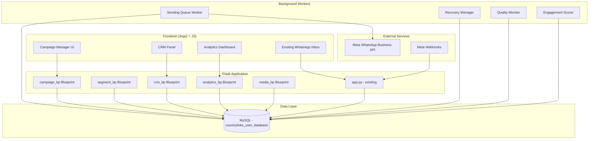
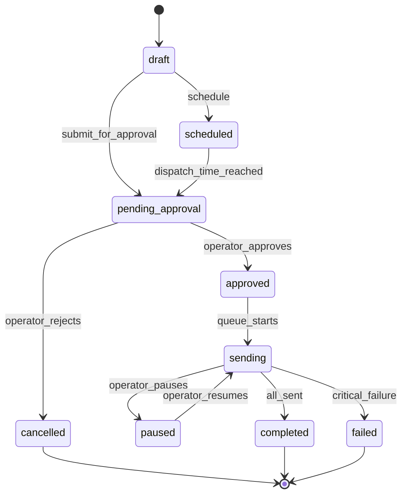

# Design Document: Enterprise WhatsApp CRM

## Overview

This design extends the existing CountryLink WhatsApp Inbox System (Flask + MySQL + Meta WhatsApp Business API) into an enterprise-grade CRM platform with campaign automation, smart segmentation, delivery tracking, and analytics. The system preserves the current operator-controlled workflow where all outbound communications require human approval.

The architecture builds on the existing `app.py` Flask application, MySQL database (`countrylinks_user_database`), and WhatsApp Business API integration. New modules are added as Flask Blueprints with background workers for queue processing, while the frontend extends the existing dark-theme workspace panel system.

### Key Design Decisions

1. **Flask Blueprints for modularity** — Each major module (Campaign Manager, Segmentation Engine, CRM Panel, Analytics) is a separate Blueprint, keeping the existing `app.py` as the entry point.
2. **MySQL-backed queue** — The Sending Queue uses database-backed job records rather than Redis/RabbitMQ to avoid new infrastructure dependencies on the existing cPanel hosting.
3. **Background threading** — Campaign dispatch uses Python `threading` + `concurrent.futures` workers (matching the existing `WEBHOOK_ASYNC_PROCESSING` pattern) to avoid blocking Flask request handlers.
4. **Channel abstraction** — A dispatch interface allows WhatsApp today and future channels (SMS, Email) without rewriting core campaign logic.
5. **Existing auth preserved** — All new endpoints use the existing Flask session authentication and role-based access from `auth.py`.

## Architecture



### Module Responsibilities

| Module | Responsibility |
|--------|---------------|
| `campaign_bp` | Campaign CRUD, lifecycle state machine, scheduling, A/B testing, test sends |
| `segment_bp` | Audience builder, filter evaluation, saved segments, real-time count estimation |
| `crm_bp` | Customer profile, notes, tags, interaction timeline |
| `analytics_bp` | Campaign metrics, retention analytics, quality dashboard, engagement scores |
| `media_bp` | File upload, media library grid, WhatsApp media type validation |
| Sending Queue Worker | Background dispatch, throttling, retry logic, cooldown enforcement |
| Recovery Manager | Startup recovery, idempotency checks, queue state persistence |
| Quality Monitor | Hourly metric aggregation, alert generation, tier tracking |
| Engagement Scorer | Post-campaign batch scoring, interaction pattern computation |

## Components and Interfaces

### 1. Campaign Manager (`campaign_bp`)

```python
# Flask Blueprint: /api/campaigns/
class CampaignService:
    def create_campaign(self, data: CampaignCreateDTO) -> Campaign
    def update_campaign(self, campaign_id: int, data: CampaignUpdateDTO) -> Campaign
    def transition_state(self, campaign_id: int, action: str, operator: str) -> Campaign
    def duplicate_campaign(self, campaign_id: int) -> Campaign
    def schedule_campaign(self, campaign_id: int, scheduled_at: datetime) -> Campaign
    def get_campaign(self, campaign_id: int) -> Campaign
    def list_campaigns(self, filters: CampaignFilters, page: int, per_page: int) -> PaginatedResult
    def simulate_campaign(self, campaign_id: int) -> SimulationResult
    def test_send(self, campaign_id: int, test_numbers: List[str]) -> List[DeliveryResult]
    def create_ab_test(self, campaign_id: int, variants: List[int], test_pct: float) -> ABTest
```

**Campaign State Machine:**



### 2. Segmentation Engine (`segment_bp`)

```python
# Flask Blueprint: /api/segments/
class SegmentationService:
    def build_query(self, filters: SegmentFilters) -> SQLQuery
    def evaluate_segment(self, segment_id: int) -> List[Customer]
    def estimate_count(self, filters: SegmentFilters) -> int
    def save_segment(self, name: str, filters: SegmentFilters) -> Segment
    def load_segment(self, segment_id: int) -> Segment
    def list_segments(self, page: int, per_page: int) -> PaginatedResult
```

**Supported Filter Fields:**
- `expiry_category`: expired | today | upcoming
- `days_remaining`: range (min, max)
- `plan_name`: exact or LIKE match
- `plan_category`: exact match
- `zone_name`: exact match
- `area`: exact or LIKE match
- `building`: exact or LIKE match
- `status`: active | inactive | disconnected
- `network_type`: exact match
- `connectivity_mode`: exact match
- `kyc_approved`: boolean
- `owner_tenant`: classification value
- `days_since_last_recharge`: derived range
- `days_inactive`: derived range
- `tags`: customer tag filter (ANY/ALL)

### 3. Sending Queue

```python
class SendingQueue:
    def enqueue_campaign(self, campaign_id: int, recipients: List[Customer]) -> int
    def process_batch(self, batch_size: int = 80) -> BatchResult
    def pause_campaign(self, campaign_id: int) -> None
    def resume_campaign(self, campaign_id: int) -> None
    def cancel_campaign(self, campaign_id: int) -> None
    def get_progress(self, campaign_id: int) -> QueueProgress

class CooldownManager:
    def check_cooldown(self, mobile: str, campaign_type: str) -> CooldownResult
    def record_send(self, mobile: str, campaign_id: int, campaign_type: str) -> None

class OptOutManager:
    def is_suppressed(self, mobile: str) -> bool
    def process_opt_out(self, mobile: str, keyword: str) -> None
    def process_opt_in(self, mobile: str, keyword: str) -> None
    def add_to_dnd(self, mobile: str, reason: str, operator: str) -> None

class RetryCategorizerService:
    def classify_error(self, error_code: int, error_message: str) -> FailureCategory
    def should_retry(self, message_id: int) -> RetryDecision
```

### 4. Channel Abstraction (Omnichannel Foundation)

```python
from abc import ABC, abstractmethod

class MessageDispatcher(ABC):
    @abstractmethod
    def send_template(self, recipient: str, template_name: str, 
                      params: List[str], media_url: Optional[str] = None) -> DispatchResult:
        pass

    @abstractmethod
    def get_channel_name(self) -> str:
        pass

class WhatsAppDispatcher(MessageDispatcher):
    """Current implementation using Meta WhatsApp Business API."""
    def send_template(self, recipient, template_name, params, media_url=None):
        # Uses existing get_whatsapp_headers(), WHATSAPP_API_VERSION
        ...

    def get_channel_name(self) -> str:
        return "whatsapp"

# Future: SMSDispatcher, EmailDispatcher, TelegramDispatcher
```

### 5. Template Validator

```python
class TemplateValidator:
    def parse_placeholders(self, template_body: str) -> List[Placeholder]
    def validate_mappings(self, template_id: int, mappings: Dict[str, str]) -> ValidationResult
    def validate_customer_params(self, customer: Customer, mappings: Dict[str, str]) -> ParamResult
    def render_preview(self, template_id: int, sample_customer: Customer) -> str
```

### 6. Quality Monitor

```python
class QualityMonitor:
    def compute_metrics(self, period_hours: int = 24) -> QualityMetrics
    def get_quality_tier(self) -> QualityTier  # GREEN, YELLOW, RED
    def check_alerts(self) -> List[Alert]
    def record_block(self, mobile: str) -> None
    def get_dashboard_data(self) -> QualityDashboard
```

### 7. Notification Engine

```python
class NotificationEngine:
    def send_alert(self, alert_type: str, severity: str, details: dict) -> None
    def get_unacknowledged(self, operator_id: int) -> List[Notification]
    def acknowledge(self, notification_id: int, operator_id: int) -> None
```

### 8. CRM Panel (`crm_bp`)

```python
class CRMService:
    def get_customer_profile(self, customer_id: int) -> CustomerProfile
    def get_interaction_timeline(self, customer_id: int, page: int) -> PaginatedTimeline
    def add_note(self, customer_id: int, note: str, operator: str) -> Note
    def add_tags(self, customer_id: int, tags: List[str], operator: str) -> None
    def remove_tag(self, customer_id: int, tag: str, operator: str) -> None
    def get_campaign_history(self, customer_id: int) -> List[CampaignDelivery]
```

### 9. Simulation Engine

```python
class SimulationEngine:
    def simulate(self, campaign_id: int) -> SimulationResult

@dataclass
class SimulationResult:
    final_audience_count: int
    estimated_send_time_seconds: int
    estimated_cost_inr: float
    exclusions: ExclusionBreakdown
    duplicate_count: int
    warnings: List[str]

@dataclass
class ExclusionBreakdown:
    cooldown: int
    opted_out: int
    dnd: int
    invalid_number: int
    incomplete_data: int
```

### 10. Recovery Manager

```python
class RecoveryManager:
    def recover_on_startup(self) -> RecoveryReport
    def identify_stale_messages(self, stale_minutes: int = 5) -> List[int]
    def deduplicate_and_requeue(self, message_ids: List[int]) -> int
```

## Data Models

### New Tables

```sql
-- Campaign management
CREATE TABLE IF NOT EXISTS campaigns (
    id BIGINT AUTO_INCREMENT PRIMARY KEY,
    organization_id BIGINT NOT NULL DEFAULT 1,
    branch_id BIGINT NOT NULL DEFAULT 1,
    name VARCHAR(255) NOT NULL,
    description TEXT,
    campaign_type ENUM('promotional', 'transactional', 'reactivation', 'ab_test') NOT NULL DEFAULT 'promotional',
    status ENUM('draft', 'scheduled', 'pending_approval', 'approved', 'sending', 'paused', 'completed', 'cancelled', 'failed') NOT NULL DEFAULT 'draft',
    segment_id BIGINT,
    template_id BIGINT,
    channel VARCHAR(50) NOT NULL DEFAULT 'whatsapp',
    scheduled_at DATETIME,
    approved_at DATETIME,
    approved_by VARCHAR(255),
    started_at DATETIME,
    completed_at DATETIME,
    priority TINYINT NOT NULL DEFAULT 5,
    recurring_frequency ENUM('none', 'daily', 'weekly', 'monthly') NOT NULL DEFAULT 'none',
    recurring_end_date DATE,
    parent_campaign_id BIGINT COMMENT 'For A/B test winner rollout',
    ab_test_percentage DECIMAL(5,2) COMMENT '10.00 to 50.00',
    total_recipients INT DEFAULT 0,
    sent_count INT DEFAULT 0,
    delivered_count INT DEFAULT 0,
    read_count INT DEFAULT 0,
    failed_count INT DEFAULT 0,
    created_by VARCHAR(255),
    created_at TIMESTAMP DEFAULT CURRENT_TIMESTAMP,
    updated_at TIMESTAMP DEFAULT CURRENT_TIMESTAMP ON UPDATE CURRENT_TIMESTAMP,
    INDEX idx_campaigns_status (status),
    INDEX idx_campaigns_scheduled (scheduled_at),
    INDEX idx_campaigns_org (organization_id),
    INDEX idx_campaigns_branch (organization_id, branch_id),
    INDEX idx_campaigns_segment (segment_id),
    INDEX idx_campaigns_template (template_id)
) ENGINE=InnoDB DEFAULT CHARSET=utf8mb4 COLLATE=utf8mb4_unicode_ci;

-- A/B test variants
CREATE TABLE IF NOT EXISTS campaign_ab_variants (
    id BIGINT AUTO_INCREMENT PRIMARY KEY,
    campaign_id BIGINT NOT NULL,
    template_id BIGINT NOT NULL,
    variant_label VARCHAR(10) NOT NULL COMMENT 'A, B, C, D',
    recipient_count INT DEFAULT 0,
    sent_count INT DEFAULT 0,
    delivered_count INT DEFAULT 0,
    read_count INT DEFAULT 0,
    response_count INT DEFAULT 0,
    is_winner TINYINT(1) DEFAULT 0,
    created_at TIMESTAMP DEFAULT CURRENT_TIMESTAMP,
    INDEX idx_ab_campaign (campaign_id),
    FOREIGN KEY (campaign_id) REFERENCES campaigns(id) ON DELETE CASCADE
) ENGINE=InnoDB DEFAULT CHARSET=utf8mb4 COLLATE=utf8mb4_unicode_ci;

-- Audience segments
CREATE TABLE IF NOT EXISTS audience_segments (
    id BIGINT AUTO_INCREMENT PRIMARY KEY,
    organization_id BIGINT NOT NULL DEFAULT 1,
    name VARCHAR(255) NOT NULL,
    description TEXT,
    filter_criteria JSON NOT NULL COMMENT 'Stored filter definition',
    estimated_count INT DEFAULT 0,
    created_by VARCHAR(255),
    created_at TIMESTAMP DEFAULT CURRENT_TIMESTAMP,
    updated_at TIMESTAMP DEFAULT CURRENT_TIMESTAMP ON UPDATE CURRENT_TIMESTAMP,
    INDEX idx_segments_org (organization_id)
) ENGINE=InnoDB DEFAULT CHARSET=utf8mb4 COLLATE=utf8mb4_unicode_ci;

-- Campaign messages (queue + delivery log)
CREATE TABLE IF NOT EXISTS campaign_messages (
    id BIGINT AUTO_INCREMENT PRIMARY KEY,
    campaign_id BIGINT NOT NULL,
    ab_variant_id BIGINT,
    customer_mobile VARCHAR(20) NOT NULL,
    customer_name VARCHAR(255),
    template_id BIGINT NOT NULL,
    template_params JSON,
    channel VARCHAR(50) NOT NULL DEFAULT 'whatsapp',
    status ENUM('queued', 'sending', 'sent', 'delivered', 'read', 'failed', 'permanently_failed', 'skipped') NOT NULL DEFAULT 'queued',
    whatsapp_message_id VARCHAR(255),
    error_code INT,
    error_message TEXT,
    error_category ENUM('transient', 'permanent', 'suppression'),
    retry_count TINYINT DEFAULT 0,
    max_retries TINYINT DEFAULT 3,
    next_retry_at DATETIME,
    sent_at DATETIME,
    delivered_at DATETIME,
    read_at DATETIME,
    failed_at DATETIME,
    idempotency_key VARCHAR(255) NOT NULL COMMENT 'campaign_id + mobile + template_id',
    created_at TIMESTAMP DEFAULT CURRENT_TIMESTAMP,
    updated_at TIMESTAMP DEFAULT CURRENT_TIMESTAMP ON UPDATE CURRENT_TIMESTAMP,
    UNIQUE KEY uk_idempotency (idempotency_key),
    INDEX idx_cm_campaign_status (campaign_id, status),
    INDEX idx_cm_mobile (customer_mobile),
    INDEX idx_cm_whatsapp_msg (whatsapp_message_id),
    INDEX idx_cm_next_retry (status, next_retry_at),
    INDEX idx_cm_sent_at (sent_at),
    FOREIGN KEY (campaign_id) REFERENCES campaigns(id) ON DELETE CASCADE
) ENGINE=InnoDB DEFAULT CHARSET=utf8mb4 COLLATE=utf8mb4_unicode_ci;

-- Campaign templates (local registry, synced from Meta)
CREATE TABLE IF NOT EXISTS campaign_templates (
    id BIGINT AUTO_INCREMENT PRIMARY KEY,
    organization_id BIGINT NOT NULL DEFAULT 1,
    template_name VARCHAR(255) NOT NULL,
    template_language VARCHAR(10) NOT NULL DEFAULT 'en',
    category ENUM('utility', 'marketing', 'authentication') NOT NULL DEFAULT 'marketing',
    status ENUM('pending', 'approved', 'rejected') NOT NULL DEFAULT 'pending',
    header_type ENUM('none', 'text', 'image', 'video', 'document') DEFAULT 'none',
    body_text TEXT,
    footer_text VARCHAR(60),
    placeholder_count INT DEFAULT 0,
    placeholder_mappings JSON COMMENT 'Maps {{1}} to customer fields',
    media_asset_id BIGINT,
    meta_template_id VARCHAR(255),
    created_at TIMESTAMP DEFAULT CURRENT_TIMESTAMP,
    updated_at TIMESTAMP DEFAULT CURRENT_TIMESTAMP ON UPDATE CURRENT_TIMESTAMP,
    INDEX idx_templates_org (organization_id),
    INDEX idx_templates_name (template_name),
    INDEX idx_templates_status (status)
) ENGINE=InnoDB DEFAULT CHARSET=utf8mb4 COLLATE=utf8mb4_unicode_ci;

-- Customer tags
CREATE TABLE IF NOT EXISTS customer_tags (
    id BIGINT AUTO_INCREMENT PRIMARY KEY,
    organization_id BIGINT NOT NULL DEFAULT 1,
    branch_id BIGINT NOT NULL DEFAULT 1,
    customer_mobile VARCHAR(20) NOT NULL,
    tag_name VARCHAR(100) NOT NULL,
    added_by VARCHAR(255),
    created_at TIMESTAMP DEFAULT CURRENT_TIMESTAMP,
    UNIQUE KEY uk_customer_tag (customer_mobile, tag_name),
    INDEX idx_tags_tag (tag_name),
    INDEX idx_tags_org (organization_id)
) ENGINE=InnoDB DEFAULT CHARSET=utf8mb4 COLLATE=utf8mb4_unicode_ci;

-- Customer notes
CREATE TABLE IF NOT EXISTS customer_notes (
    id BIGINT AUTO_INCREMENT PRIMARY KEY,
    organization_id BIGINT NOT NULL DEFAULT 1,
    branch_id BIGINT NOT NULL DEFAULT 1,
    customer_mobile VARCHAR(20) NOT NULL,
    note_text TEXT NOT NULL,
    added_by VARCHAR(255) NOT NULL,
    created_at TIMESTAMP DEFAULT CURRENT_TIMESTAMP,
    INDEX idx_notes_mobile (customer_mobile),
    INDEX idx_notes_org (organization_id)
) ENGINE=InnoDB DEFAULT CHARSET=utf8mb4 COLLATE=utf8mb4_unicode_ci;

-- Customer activity / interaction timeline
CREATE TABLE IF NOT EXISTS customer_activity (
    id BIGINT AUTO_INCREMENT PRIMARY KEY,
    customer_mobile VARCHAR(20) NOT NULL,
    activity_type ENUM('message_sent', 'message_received', 'campaign_sent', 'note_added', 'tag_added', 'tag_removed', 'status_change', 'opt_out', 'opt_in') NOT NULL,
    channel VARCHAR(50) DEFAULT 'whatsapp',
    reference_id BIGINT COMMENT 'FK to related table record',
    details JSON,
    created_at TIMESTAMP DEFAULT CURRENT_TIMESTAMP,
    INDEX idx_activity_mobile (customer_mobile),
    INDEX idx_activity_type (activity_type),
    INDEX idx_activity_created (created_at)
) ENGINE=InnoDB DEFAULT CHARSET=utf8mb4 COLLATE=utf8mb4_unicode_ci;

-- Campaign analytics (pre-computed summaries)
CREATE TABLE IF NOT EXISTS campaign_analytics (
    id BIGINT AUTO_INCREMENT PRIMARY KEY,
    organization_id BIGINT NOT NULL DEFAULT 1,
    campaign_id BIGINT,
    metric_type VARCHAR(50) NOT NULL COMMENT 'delivery_rate, read_rate, quality_snapshot, etc.',
    metric_value DECIMAL(10,4),
    dimensions JSON COMMENT '{"zone": "...", "template": "...", "period": "..."}',
    period_start DATETIME,
    period_end DATETIME,
    computed_at TIMESTAMP DEFAULT CURRENT_TIMESTAMP,
    INDEX idx_analytics_campaign (campaign_id),
    INDEX idx_analytics_type (metric_type),
    INDEX idx_analytics_period (period_start, period_end),
    INDEX idx_analytics_org (organization_id)
) ENGINE=InnoDB DEFAULT CHARSET=utf8mb4 COLLATE=utf8mb4_unicode_ci;

-- Automation rules
CREATE TABLE IF NOT EXISTS automation_rules (
    id BIGINT AUTO_INCREMENT PRIMARY KEY,
    organization_id BIGINT NOT NULL DEFAULT 1,
    tenant_id BIGINT NOT NULL DEFAULT 1,
    name VARCHAR(255) NOT NULL,
    trigger_type ENUM('schedule', 'event', 'threshold') NOT NULL,
    trigger_config JSON NOT NULL,
    condition_config JSON,
    action_type ENUM('create_campaign_draft', 'notify_operator') NOT NULL,
    action_config JSON NOT NULL,
    is_active TINYINT(1) DEFAULT 1,
    last_triggered_at DATETIME,
    created_by VARCHAR(255),
    created_at TIMESTAMP DEFAULT CURRENT_TIMESTAMP,
    updated_at TIMESTAMP DEFAULT CURRENT_TIMESTAMP ON UPDATE CURRENT_TIMESTAMP,
    INDEX idx_rules_org (organization_id),
    INDEX idx_rules_active (is_active)
) ENGINE=InnoDB DEFAULT CHARSET=utf8mb4 COLLATE=utf8mb4_unicode_ci;

-- Media assets
CREATE TABLE IF NOT EXISTS media_assets (
    id BIGINT AUTO_INCREMENT PRIMARY KEY,
    organization_id BIGINT NOT NULL DEFAULT 1,
    filename VARCHAR(255) NOT NULL,
    original_filename VARCHAR(255) NOT NULL,
    mime_type VARCHAR(100) NOT NULL,
    file_size_bytes BIGINT NOT NULL,
    media_type ENUM('image', 'video', 'document') NOT NULL,
    storage_path VARCHAR(500) NOT NULL,
    thumbnail_path VARCHAR(500),
    usage_count INT DEFAULT 0,
    uploaded_by VARCHAR(255),
    created_at TIMESTAMP DEFAULT CURRENT_TIMESTAMP,
    INDEX idx_media_org (organization_id),
    INDEX idx_media_type (media_type)
) ENGINE=InnoDB DEFAULT CHARSET=utf8mb4 COLLATE=utf8mb4_unicode_ci;

-- Suppression list (opt-outs + blocks)
CREATE TABLE IF NOT EXISTS suppression_list (
    id BIGINT AUTO_INCREMENT PRIMARY KEY,
    organization_id BIGINT NOT NULL DEFAULT 1,
    customer_mobile VARCHAR(20) NOT NULL,
    reason ENUM('opt_out_keyword', 'manual_dnd', 'user_blocked', 'spam_reported', 'invalid_number') NOT NULL,
    source_keyword VARCHAR(50),
    added_by VARCHAR(255),
    is_active TINYINT(1) DEFAULT 1,
    created_at TIMESTAMP DEFAULT CURRENT_TIMESTAMP,
    removed_at DATETIME,
    UNIQUE KEY uk_suppression_mobile (customer_mobile, reason),
    INDEX idx_suppression_active (is_active, customer_mobile),
    INDEX idx_suppression_org (organization_id)
) ENGINE=InnoDB DEFAULT CHARSET=utf8mb4 COLLATE=utf8mb4_unicode_ci;

-- Customer engagement scores
CREATE TABLE IF NOT EXISTS customer_engagement (
    id BIGINT AUTO_INCREMENT PRIMARY KEY,
    customer_mobile VARCHAR(20) NOT NULL,
    messages_received_count INT DEFAULT 0,
    messages_read_count INT DEFAULT 0,
    response_count INT DEFAULT 0,
    avg_time_to_read_seconds INT,
    last_interaction_at DATETIME,
    interaction_score TINYINT DEFAULT 0 COMMENT '0-100',
    engagement_trend ENUM('increasing', 'stable', 'declining') DEFAULT 'stable',
    preferred_time_window ENUM('morning', 'afternoon', 'evening') DEFAULT 'afternoon',
    avg_response_time_seconds INT,
    updated_at TIMESTAMP DEFAULT CURRENT_TIMESTAMP ON UPDATE CURRENT_TIMESTAMP,
    UNIQUE KEY uk_engagement_mobile (customer_mobile),
    INDEX idx_engagement_score (interaction_score)
) ENGINE=InnoDB DEFAULT CHARSET=utf8mb4 COLLATE=utf8mb4_unicode_ci;

-- Notifications
CREATE TABLE IF NOT EXISTS system_notifications (
    id BIGINT AUTO_INCREMENT PRIMARY KEY,
    organization_id BIGINT NOT NULL DEFAULT 1,
    alert_type VARCHAR(50) NOT NULL COMMENT 'campaign_degraded, queue_overloaded, webhook_connectivity, template_rejected, quality_drop',
    severity ENUM('info', 'warning', 'critical') NOT NULL,
    title VARCHAR(255) NOT NULL,
    details JSON,
    target_operators JSON COMMENT 'List of operator names to notify',
    acknowledged_by VARCHAR(255),
    acknowledged_at DATETIME,
    delivered_push TINYINT(1) DEFAULT 0,
    delivered_whatsapp TINYINT(1) DEFAULT 0,
    created_at TIMESTAMP DEFAULT CURRENT_TIMESTAMP,
    INDEX idx_notif_type (alert_type),
    INDEX idx_notif_severity (severity),
    INDEX idx_notif_ack (acknowledged_at),
    INDEX idx_notif_org (organization_id)
) ENGINE=InnoDB DEFAULT CHARSET=utf8mb4 COLLATE=utf8mb4_unicode_ci;

-- Error classification lookup
CREATE TABLE IF NOT EXISTS error_classifications (
    id INT AUTO_INCREMENT PRIMARY KEY,
    error_code INT NOT NULL,
    error_pattern VARCHAR(255),
    category ENUM('transient', 'permanent', 'suppression') NOT NULL,
    description VARCHAR(255),
    should_retry TINYINT(1) DEFAULT 0,
    UNIQUE KEY uk_error_code (error_code)
) ENGINE=InnoDB DEFAULT CHARSET=utf8mb4 COLLATE=utf8mb4_unicode_ci;

-- Cooldown tracking
CREATE TABLE IF NOT EXISTS message_cooldowns (
    id BIGINT AUTO_INCREMENT PRIMARY KEY,
    customer_mobile VARCHAR(20) NOT NULL,
    campaign_id BIGINT NOT NULL,
    campaign_type VARCHAR(50) NOT NULL,
    sent_at TIMESTAMP DEFAULT CURRENT_TIMESTAMP,
    INDEX idx_cooldown_mobile_type (customer_mobile, campaign_type, sent_at),
    INDEX idx_cooldown_sent (sent_at)
) ENGINE=InnoDB DEFAULT CHARSET=utf8mb4 COLLATE=utf8mb4_unicode_ci;

-- Quality metrics history
CREATE TABLE IF NOT EXISTS quality_metrics (
    id BIGINT AUTO_INCREMENT PRIMARY KEY,
    period_start DATETIME NOT NULL,
    period_end DATETIME NOT NULL,
    blocked_count INT DEFAULT 0,
    failure_rate DECIMAL(5,4) DEFAULT 0,
    opt_out_rate DECIMAL(5,4) DEFAULT 0,
    read_rate DECIMAL(5,4) DEFAULT 0,
    quality_tier ENUM('green', 'yellow', 'red') DEFAULT 'green',
    computed_at TIMESTAMP DEFAULT CURRENT_TIMESTAMP,
    INDEX idx_quality_period (period_start)
) ENGINE=InnoDB DEFAULT CHARSET=utf8mb4 COLLATE=utf8mb4_unicode_ci;
```

### Altered Existing Tables

```sql
-- Add channel and campaign reference to whatsapp_campaign_logs
ALTER TABLE whatsapp_campaign_logs
    ADD COLUMN IF NOT EXISTS campaign_id BIGINT AFTER id,
    ADD COLUMN IF NOT EXISTS channel VARCHAR(50) DEFAULT 'whatsapp' AFTER campaign_id,
    ADD INDEX IF NOT EXISTS idx_wcl_campaign (campaign_id);

-- Add campaign permission to operator_actions
ALTER TABLE operator_actions
    ADD COLUMN IF NOT EXISTS campaign_id BIGINT AFTER target_id,
    ADD INDEX IF NOT EXISTS idx_oa_campaign (campaign_id);

-- Add tags/engagement columns to renewal_records for segmentation
ALTER TABLE renewal_records
    ADD COLUMN IF NOT EXISTS network_type VARCHAR(50) AFTER zone_name,
    ADD COLUMN IF NOT EXISTS connectivity_mode VARCHAR(50) AFTER network_type,
    ADD COLUMN IF NOT EXISTS plan_category VARCHAR(100) AFTER plan_name,
    ADD COLUMN IF NOT EXISTS building VARCHAR(255) AFTER zone_name,
    ADD COLUMN IF NOT EXISTS area VARCHAR(255) AFTER zone_name,
    ADD COLUMN IF NOT EXISTS status VARCHAR(50) DEFAULT 'active' AFTER category,
    ADD COLUMN IF NOT EXISTS activation_date DATE AFTER expiry_date,
    ADD COLUMN IF NOT EXISTS kyc_approved TINYINT(1) DEFAULT 0 AFTER status,
    ADD COLUMN IF NOT EXISTS owner_tenant VARCHAR(50) AFTER kyc_approved;
```


## Correctness Properties

*A property is a characteristic or behavior that should hold true across all valid executions of a system — essentially, a formal statement about what the system should do. Properties serve as the bridge between human-readable specifications and machine-verifiable correctness guarantees.*

### Property 1: Campaign state machine transition validity

*For any* campaign in any valid state and any transition action, the state machine SHALL only allow transitions defined in the valid transition graph (draft→scheduled, draft→pending_approval, scheduled→pending_approval, pending_approval→approved, pending_approval→cancelled, approved→sending, sending→paused, paused→sending, sending→completed, sending→failed), and SHALL reject all other transitions with an error.

**Validates: Requirements 1.2**

### Property 2: Queue manipulation preserves message invariants

*For any* campaign with N queued messages, pausing SHALL result in 0 new messages being dispatched for that campaign, resuming SHALL only dispatch messages with status "queued", and cancelling SHALL transition all remaining queued messages to "cancelled" status with none dispatched.

**Validates: Requirements 1.5, 1.6, 1.7**

### Property 3: Campaign duplication preserves configuration

*For any* campaign with a segment, template, and configuration parameters, duplicating it SHALL produce a new campaign in "draft" state where the segment_id, template_id, campaign_type, and all configuration fields are identical to the original.

**Validates: Requirements 1.8**

### Property 4: No messages dispatched without explicit operator approval

*For any* campaign created by an Automation_Rule or reaching its scheduled time, the Sending_Queue SHALL contain zero dispatched messages for that campaign until an operator explicitly approves it (status transitions through "pending_approval" → "approved").

**Validates: Requirements 2.5**

### Property 5: Every campaign action produces an audit log entry

*For any* campaign state-changing action (create, edit, approve, reject, pause, cancel, send), the operator_actions table SHALL contain a corresponding record with non-null operator_name, a valid action_type, the correct campaign_id, and a timestamp within 1 second of the action.

**Validates: Requirements 2.6, 11.2**

### Property 6: Segmentation AND-filter returns only matching customers

*For any* combination of filter criteria and any customer dataset, every customer returned by the Segmentation_Engine SHALL satisfy ALL applied filter criteria independently, and no customer satisfying all criteria SHALL be omitted from results.

**Validates: Requirements 3.1, 3.2**

### Property 7: Segment save/load round-trip

*For any* valid segment definition (name + filter criteria), saving it and then loading it by ID SHALL return filter criteria that are semantically equivalent to the original, producing the same customer set when evaluated.

**Validates: Requirements 3.3**

### Property 8: Derived filter computation correctness

*For any* customer record with activation_date and expiry_date, the "days since last recharge" derived value SHALL equal (current_date - activation_date).days, and for any inactive/expired customer, "days inactive" SHALL equal (current_date - expiry_date).days when expiry_date < current_date.

**Validates: Requirements 3.6, 3.7**

### Property 9: Retry backoff computation

*For any* retry attempt number N (1, 2, or 3), the computed backoff delay SHALL equal 5 * 3^(N-1) seconds (producing 5s, 15s, 45s), and no message SHALL be retried more than 3 times.

**Validates: Requirements 4.3**

### Property 10: Idempotency prevents duplicate message delivery

*For any* campaign with a recipient list containing duplicate mobile numbers, or during recovery re-processing, the system SHALL produce exactly one campaign_message record per unique (campaign_id, customer_mobile, template_id) combination, enforced by the idempotency_key unique constraint.

**Validates: Requirements 4.5, 26.3**

### Property 11: Webhook status updates apply to correct records

*For any* valid webhook status callback containing a whatsapp_message_id and a status (delivered, read, failed), the system SHALL update exactly the campaign_message record matching that whatsapp_message_id, and the new status timestamp SHALL be recorded.

**Validates: Requirements 5.2**

### Property 12: Delivery rate computation correctness

*For any* campaign with total_sent > 0 messages, delivery_rate SHALL equal delivered_count / total_sent, read_rate SHALL equal read_count / total_sent, and failure_rate SHALL equal failed_count / total_sent, with all rates bounded in [0.0, 1.0] and test-send messages excluded from all counts.

**Validates: Requirements 5.3, 8.1, 16.3**

### Property 13: Timeline ordering consistency

*For any* customer with interaction records of multiple types (messages, campaigns, notes, tags, status changes), the interaction timeline SHALL return all records merged in strictly reverse chronological order by created_at timestamp, with no records omitted.

**Validates: Requirements 7.2, 7.6**

### Property 14: Tags assigned to customers are queryable in segmentation

*For any* customer with assigned tags, the Segmentation_Engine SHALL include that customer in results when filtering by any of their assigned tags, and SHALL exclude customers who do not have the filtered tag.

**Validates: Requirements 7.5**

### Property 15: Date range filtering includes only records within bounds

*For any* date range [start, end] applied to analytics queries, all returned records SHALL have their relevant timestamp >= start AND <= end, with no records outside the range included.

**Validates: Requirements 8.4**

### Property 16: Role-based permission enforcement

*For any* operator without the "campaign_send" permission, attempting to approve or trigger a campaign send SHALL be rejected with HTTP 403, and for any operator with "campaign_send" permission, the action SHALL be allowed to proceed.

**Validates: Requirements 11.1**

### Property 17: Template parameter sanitization

*For any* string value used as a template parameter, the sanitization function SHALL remove or escape all control characters (U+0000–U+001F, U+007F–U+009F) while preserving all printable Unicode characters including Hindi/Marathi scripts, and the sanitized output length SHALL be <= the input length.

**Validates: Requirements 11.6**

### Property 18: A/B test even audience split

*For any* audience of size N and variant count V (2 ≤ V ≤ 4), the A/B split SHALL assign each variant either floor(N/V) or ceil(N/V) recipients, ensuring the difference between any two variants is at most 1 recipient.

**Validates: Requirements 13.2**

### Property 19: Media file size validation

*For any* file upload with a given media_type and file_size, the Media_Library SHALL accept it if and only if: (media_type=image AND size ≤ 5MB) OR (media_type=video AND size ≤ 16MB) OR (media_type=document AND size ≤ 100MB), rejecting all others with the specific constraint violated.

**Validates: Requirements 14.2**

### Property 20: Cooldown enforcement correctness

*For any* customer and promotional campaign, the Cooldown_Manager SHALL exclude the customer if they received a promotional message within 72 hours (or 120 hours when quality tier is Yellow), OR if they have received 2+ promotional campaigns within the rolling 7-day period. Reactivation campaigns SHALL enforce a 7-day minimum cooldown for the same workflow type.

**Validates: Requirements 17.1, 17.3, 6.4, 18.5**

### Property 21: Transactional messages bypass cooldown

*For any* transactional message (payment confirmations, service alerts), the Cooldown_Manager SHALL never block delivery regardless of the customer's promotional cooldown state or frequency count.

**Validates: Requirements 17.6**

### Property 22: Opt-out keyword recognition and round-trip

*For any* message containing one of the opt-out keywords ("STOP", "UNSUBSCRIBE", "OPT OUT", "CANCEL", "DND") in any case variant, the Opt_Out_Manager SHALL add the sender to the suppression list. Subsequently, *for any* message containing "START" or "SUBSCRIBE" from the same sender, the Opt_Out_Manager SHALL remove them from the suppression list.

**Validates: Requirements 19.1, 19.2, 19.5**

### Property 23: Suppression list enforcement at dispatch time

*For any* customer on the active suppression list (opted-out, DND, blocked, or invalid number), the Sending_Queue SHALL never dispatch a campaign message to that customer, regardless of segment membership.

**Validates: Requirements 19.3**

### Property 24: Template placeholder parsing and mapping validation

*For any* template body containing N placeholder variables ({{1}}, {{2}}, ... or {{name}}, {{plan}}, ...), the Template_Validator SHALL identify exactly N placeholders, and SHALL block campaign approval if fewer than N mappings are provided or if any resolved parameter value is null, empty, or exceeds 1024 characters.

**Validates: Requirements 20.1, 20.2, 20.5, 20.6**

### Property 25: Error code classification determinism

*For any* WhatsApp API error code present in the error_classifications lookup table, the Retry_Categorizer SHALL return exactly one category (transient, permanent, or suppression), and the classification SHALL be deterministic (same code always maps to same category).

**Validates: Requirements 21.1**

### Property 26: Threshold-triggered alert correctness

*For any* campaign where failure_rate > 10%, the Notification_Engine SHALL generate a "campaign_degraded" alert. *For any* rolling 24-hour window where blocked_count increase > 10, a "block_spike" alert SHALL be generated. *For any* active campaign where suppression_rate > 20%, an automatic pause SHALL be triggered.

**Validates: Requirements 18.2, 18.3, 21.7, 25.1**

### Property 27: Simulation computation correctness

*For any* campaign with an audience segment of size N, the Simulation_Engine SHALL compute: final_audience = N - (cooldown_excluded + opted_out + dnd + invalid + incomplete), estimated_time = final_audience / throttle_rate, and estimated_cost = final_audience * per_message_rate, with all exclusion counts being non-negative and summing to total_excluded.

**Validates: Requirements 22.1, 22.2, 22.4**

### Property 28: Simulation exclusion warning threshold

*For any* simulation where total_excluded / original_audience > 0.30, the Simulation_Engine SHALL include a prominent warning in the result. When total_excluded / original_audience ≤ 0.30, no such warning SHALL be generated.

**Validates: Requirements 22.5**

### Property 29: Engagement score bounded computation

*For any* customer engagement metrics (read_rate, response_rate, recency_score, frequency_score all in [0,100]), the interaction_score SHALL equal round(0.4 * read_rate + 0.3 * response_rate + 0.2 * recency_score + 0.1 * frequency_score), bounded to [0, 100].

**Validates: Requirements 23.2**

### Property 30: Stale message recovery reset

*For any* campaign_message record with status "sending" and updated_at older than 5 minutes from current time, the Recovery_Manager SHALL reset its status to "queued" for re-dispatch, ensuring no message remains permanently stuck in "sending" state.

**Validates: Requirements 26.6**

## Error Handling

### API Error Handling Strategy

| Error Type | Response Code | Behavior |
|-----------|--------------|----------|
| Authentication failure | 401 | Redirect to login, clear session |
| Permission denied | 403 | Display "insufficient permissions" message |
| Resource not found | 404 | Display "not found" with back navigation |
| Validation error | 422 | Return field-level error details as JSON |
| Rate limit (Meta API) | 429 | Queue for retry with backoff |
| Server error | 500 | Log full stack trace, display generic error |
| Database connection failure | 503 | Retry with backoff, alert operator |

### Campaign-Specific Error Handling

1. **Template send failure** — Classified by Retry_Categorizer, handled per category (retry/suppress/flag)
2. **Segment evaluation timeout** — Return partial results with warning, suggest narrowing filters
3. **Media upload failure** — Return specific constraint violated, suggest resize/format change
4. **Queue worker crash** — Recovery Manager detects stale "sending" records and re-queues on next startup
5. **Webhook delivery gap** — Quality Monitor detects 5-minute silence and alerts operators
6. **Database deadlock** — Retry transaction up to 3 times with random jitter

### Graceful Degradation

- If Meta API is unreachable, campaigns queue messages and retry when connectivity returns
- If Quality Monitor cannot compute metrics (insufficient data), display "insufficient data" rather than zeros
- If background worker dies, the Recovery Manager ensures no message loss on restart
- If MySQL connection pool is exhausted, return 503 with "system busy" message and retry hint

## Testing Strategy

### Dual Testing Approach

**Unit Tests (Jest + Python unittest):**
- Flask route handler tests with mocked database
- Service layer logic tests with test fixtures
- Validation function tests with concrete examples
- Error handling path verification
- Integration between components (e.g., campaign creation → queue enqueue)

**Property-Based Tests (fast-check for JS logic, Hypothesis for Python):**
- Universal properties validated across generated inputs
- Minimum 100 iterations per property test
- Each test references its design document property number
- Tag format: `Feature: enterprise-whatsapp-crm, Property {N}: {title}`

### Property-Based Testing Configuration

**JavaScript (fast-check) — for frontend validation, computation logic:**
```javascript
// jest.config.js already configured with fast-check available
// Each property test: minimum 100 runs (fc.assert default)
```

**Python (Hypothesis) — for backend service logic:**
```python
# Add to requirements.txt: hypothesis>=6.100.0
# settings(max_examples=100) minimum per property
```

### Test Coverage Plan

| Layer | Tool | Focus |
|-------|------|-------|
| Segmentation logic | Hypothesis (Python) | Filter AND-semantics, derived filters, tag queries |
| Cooldown/suppression | Hypothesis (Python) | Time-window enforcement, transactional bypass |
| Template validation | Hypothesis (Python) | Placeholder parsing, parameter constraints, sanitization |
| State machine | fast-check (JS) | Valid/invalid transitions, guard conditions |
| Rate computation | fast-check (JS) | Delivery metrics, percentage calculations |
| Simulation engine | Hypothesis (Python) | Exclusion math, cost/time estimates |
| Retry/backoff | Hypothesis (Python) | Exponential delays, category classification |
| Queue deduplication | Hypothesis (Python) | Idempotency key uniqueness |
| Engagement scoring | Hypothesis (Python) | Weighted score bounds, trend classification |
| A/B split | fast-check (JS) | Even distribution within ±1 |
| Opt-out keywords | Hypothesis (Python) | Case-insensitive matching, round-trip |
| Timeline ordering | fast-check (JS) | Chronological merge of heterogeneous records |
| Media validation | fast-check (JS) | Size/type acceptance matrix |

### Integration Tests

- Campaign full lifecycle: create → schedule → approve → send → complete
- Webhook processing: receive status updates and verify Delivery_Log
- Recovery: simulate crash, restart, verify no duplicates
- Quality degradation: simulate high failure rate, verify adaptive cooldown and alerts

### End-to-End Tests (Playwright — existing setup)

- Campaign creation wizard flow
- Audience builder with real-time count
- CRM panel slide-out from inbox
- Analytics dashboard date range filtering
