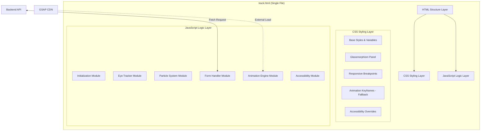
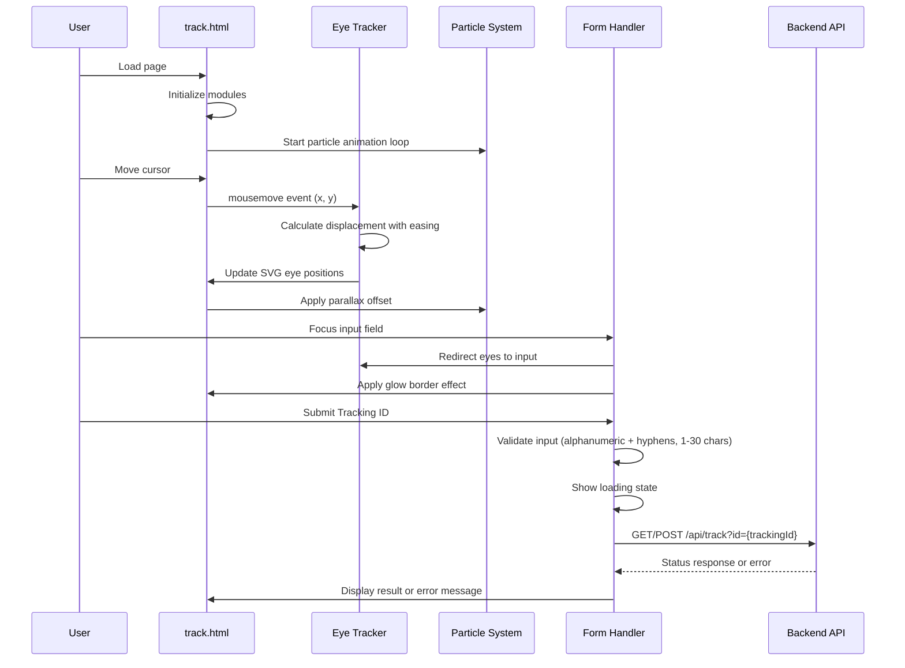

# Design Document: Interactive Tracking Page

## Overview

The Interactive Tracking Page (`track.html`) is a standalone, single-file HTML page for the CountryLinks broadband ISP management system. It provides customers with a visually engaging interface to look up the status of their broadband installation or service requests using a Tracking ID.

The page features:
- A 3D-style SVG robot mascot with real-time eye-tracking that follows the user's cursor
- GSAP-powered animations running at 60fps for premium motion quality
- A glassmorphism UI panel containing the tracking form
- A particle system background representing network signals
- Full responsive design from 320px to 1920px
- Accessibility compliance (WCAG 2.1 AA)
- Graceful degradation when GSAP CDN fails or `prefers-reduced-motion` is enabled

The page integrates with the existing PHP/Flask backend by submitting tracking lookups via a standard HTTP request or fetch API call to an existing endpoint.

### Design Decisions

1. **Single HTML file**: All CSS and JS are inline to simplify deployment in the existing PHP-based hosting environment. No build step required.
2. **GSAP from CDN**: Using GSAP 3.x from cdnjs for animation performance, with CSS-only fallback if CDN fails.
3. **Inline SVG for mascot**: Vector-based rendering ensures crisp display at all viewport sizes without external image requests.
4. **Canvas for particle system**: Using a `<canvas>` element for the particle system avoids layout recalculations and provides efficient rendering.
5. **No framework dependencies**: Pure vanilla JS keeps the page lightweight and avoids conflicts with the existing PHP/jQuery stack.

## Architecture

The page follows a layered architecture within a single HTML file:



### Module Responsibilities

| Module | Responsibility |
|--------|---------------|
| Initialization | Feature detection, GSAP load check, reduced-motion detection, module bootstrapping |
| Eye Tracker | Cursor position tracking, eye displacement calculation, easing, idle detection |
| Particle System | Canvas-based particle rendering, parallax effect, frame rate management |
| Form Handler | Input validation, submission, loading state, error display, ARIA announcements |
| Animation Engine | GSAP timeline management, hover/focus effects, mascot idle animations |
| Accessibility | Reduced-motion handling, focus management, ARIA live region updates |

### Data Flow



## Components and Interfaces

### 1. HTML Structure

```
<!DOCTYPE html>
<html lang="en">
├── <head>
│   ├── <meta charset="UTF-8">
│   ├── <meta name="viewport" content="width=device-width, initial-scale=1.0">
│   ├── <meta name="description" content="Track your broadband installation...">
│   ├── <title>Track Your Service - CountryLinks</title>
│   └── <style>/* All CSS inline */</style>
├── <body>
│   ├── <canvas id="particle-canvas">  <!-- Background particle system -->
│   ├── <header>
│   │   └──  CountryLinks logo
│   ├── <main>
│   │   └── <div class="glass-panel">  <!-- Glassmorphism container -->
│   │       ├── <svg id="mascot">      <!-- Robot mascot SVG -->
│   │       │   ├── Body group
│   │       │   ├── Eye sockets + pupils (animated)
│   │       │   ├── Antenna + signal waves
│   │       │   └── Decorative elements
│   │       ├── <form id="tracking-form">
│   │       │   ├── <label for="tracking-input">
│   │       │   ├── <input id="tracking-input" maxlength="30">
│   │       │   ├── <button type="submit">Track Status</button>
│   │       │   └── <div aria-live="assertive" id="form-messages">
│   │       └── <p class="subtitle">Track your broadband installation...</p>
│   ├── <footer> (minimal)
│   ├── <script src="https://cdnjs.cloudflare.com/ajax/libs/gsap/3.12.5/gsap.min.js">
│   └── <script>/* All JS inline */</script>
```

### 2. Eye Tracker Interface

```javascript
/**
 * EyeTracker module - manages mascot eye position based on cursor/focus
 */
const EyeTracker = {
  config: {
    maxDisplacement: 0.3,    // 30% of eye socket radius
    easingDuration: 0.2,     // 200ms minimum transition
    idleTimeout: 3000,       // 3 seconds before idle animations
    blinkInterval: [3000, 5000], // Random blink every 3-5 seconds
    blinkDuration: [150, 300],   // Blink animation duration range
    headMovementMax: 5,      // Max 5px head displacement on keystroke
  },
  
  /** Initialize eye tracking listeners */
  init(): void,
  
  /** Calculate eye displacement from cursor position */
  calculateDisplacement(cursorX: number, cursorY: number): {x: number, y: number},
  
  /** Apply proportional displacement based on cursor distance to mascot */
  applyProximityScaling(displacement: {x, y}, distance: number): {x: number, y: number},
  
  /** Animate eyes to target position with easing */
  animateEyes(targetX: number, targetY: number): void,
  
  /** Redirect eyes toward input field */
  lookAtInput(): void,
  
  /** Return eyes to center (neutral) position */
  resetToCenter(): void,
  
  /** Trigger blink animation */
  blink(): void,
  
  /** Start idle animation loop */
  startIdleLoop(): void,
  
  /** Stop idle animation loop */
  stopIdleLoop(): void,
  
  /** Handle keystroke reaction (blink + head movement) */
  onKeystroke(): void,
}
```

### 3. Particle System Interface

```javascript
/**
 * ParticleSystem module - canvas-based background animation
 */
const ParticleSystem = {
  config: {
    desktopCount: [30, 60],   // Particle count range for desktop
    mobileCount: [15, 30],    // 50% of desktop for mobile
    maxParallax: 20,          // Max 20px parallax displacement
    minFPS: 30,               // Minimum acceptable frame rate
  },
  
  /** Initialize canvas and create particles */
  init(canvas: HTMLCanvasElement): void,
  
  /** Main animation loop using requestAnimationFrame */
  animate(): void,
  
  /** Update particle positions */
  updateParticles(): void,
  
  /** Apply parallax offset based on cursor position */
  applyParallax(cursorX: number, cursorY: number): void,
  
  /** Adjust particle count based on viewport */
  adjustForViewport(): void,
  
  /** Pause animations (for reduced-motion) */
  pause(): void,
  
  /** Resume animations */
  resume(): void,
  
  /** Destroy and clean up */
  destroy(): void,
}
```

### 4. Form Handler Interface

```javascript
/**
 * FormHandler module - tracking form validation and submission
 */
const FormHandler = {
  config: {
    maxLength: 30,
    validPattern: /^[a-zA-Z0-9-]{1,30}$/,
    timeout: 15000,  // 15 second timeout
    apiEndpoint: '/api/track',
  },
  
  /** Initialize form event listeners */
  init(formElement: HTMLFormElement): void,
  
  /** Validate tracking ID format */
  validate(trackingId: string): {valid: boolean, message?: string},
  
  /** Submit tracking lookup request */
  submit(trackingId: string): Promise<TrackingResult>,
  
  /** Show loading state on button */
  showLoading(): void,
  
  /** Hide loading state and re-enable button */
  hideLoading(): void,
  
  /** Display validation/error message with ARIA announcement */
  showMessage(message: string, type: 'error' | 'success' | 'info'): void,
  
  /** Clear displayed messages */
  clearMessages(): void,
}
```

### 5. Animation Engine Interface

```javascript
/**
 * AnimationEngine module - GSAP-based animation management
 */
const AnimationEngine = {
  /** Whether GSAP loaded successfully */
  gsapAvailable: boolean,
  
  /** Whether reduced-motion is preferred */
  reducedMotion: boolean,
  
  /** Initialize animation engine, detect GSAP availability */
  init(): void,
  
  /** Animate element with GSAP or CSS fallback */
  animate(element: Element, properties: object, options: object): void,
  
  /** Create hover lift effect for button */
  createHoverEffect(button: HTMLElement): void,
  
  /** Create focus glow effect for input */
  createFocusEffect(input: HTMLElement): void,
  
  /** Handle reduced-motion preference changes */
  onReducedMotionChange(matches: boolean): void,
}
```

## Data Models

### Tracking Form State

```javascript
/**
 * @typedef {Object} FormState
 * @property {string} trackingId - Current input value
 * @property {boolean} isLoading - Whether a request is in progress
 * @property {boolean} isValid - Whether current input passes validation
 * @property {string|null} errorMessage - Current error message or null
 * @property {string|null} successMessage - Current success message or null
 */
```

### Eye Tracker State

```javascript
/**
 * @typedef {Object} EyeState
 * @property {{x: number, y: number}} currentPosition - Current eye displacement (0-1 range)
 * @property {{x: number, y: number}} targetPosition - Target eye displacement
 * @property {boolean} isIdle - Whether the page is idle (no cursor movement > 3s)
 * @property {number|null} idleTimer - Timer ID for idle detection
 * @property {number|null} blinkTimer - Timer ID for periodic blinking
 * @property {boolean} isBlinking - Whether a blink animation is in progress
 */
```

### Particle State

```javascript
/**
 * @typedef {Object} Particle
 * @property {number} x - Current X position
 * @property {number} y - Current Y position
 * @property {number} baseX - Original X position (for parallax)
 * @property {number} baseY - Original Y position (for parallax)
 * @property {number} size - Particle radius in pixels
 * @property {number} speedX - Horizontal velocity
 * @property {number} speedY - Vertical velocity
 * @property {number} opacity - Current opacity (0-1)
 * @property {string} color - Particle color (cyan spectrum)
 */
```

### Tracking API Response

```javascript
/**
 * @typedef {Object} TrackingResult
 * @property {boolean} success - Whether the lookup succeeded
 * @property {string} trackingId - The queried tracking ID
 * @property {string} [status] - Current status (e.g., "In Progress", "Completed")
 * @property {string} [message] - Human-readable status description
 * @property {string} [error] - Error message if lookup failed
 */
```

### Validation Result

```javascript
/**
 * @typedef {Object} ValidationResult
 * @property {boolean} valid - Whether the input is valid
 * @property {string} [message] - Error message if invalid
 */
```

## Correctness Properties

*A property is a characteristic or behavior that should hold true across all valid executions of a system — essentially, a formal statement about what the system should do. Properties serve as the bridge between human-readable specifications and machine-verifiable correctness guarantees.*

### Property 1: Eye displacement is bounded and proportionally scaled

*For any* cursor position (x, y) within the viewport, the calculated eye displacement SHALL have a magnitude no greater than 30% of the eye socket radius, AND the displacement SHALL scale proportionally from 10% of maximum at the viewport edge to 100% of maximum when the cursor is adjacent to the mascot.

**Validates: Requirements 1.1, 1.5**

### Property 2: Head movement on keystroke is bounded

*For any* keystroke event triggered while the input field is focused, the resulting head displacement SHALL be no greater than 5px in any direction.

**Validates: Requirements 1.3**

### Property 3: Parallax displacement is bounded

*For any* cursor position (x, y) within the viewport, the calculated parallax offset for background elements SHALL have a magnitude no greater than 20px from the element's origin position.

**Validates: Requirements 3.3**

### Property 4: Tracking ID validation is correct

*For any* string input, the validation function SHALL return `valid: true` if and only if the string matches the pattern `[a-zA-Z0-9-]{1,30}` (contains only alphanumeric characters and hyphens, with length between 1 and 30 inclusive). All other strings SHALL be rejected.

**Validates: Requirements 5.6, 5.7**

### Property 5: No horizontal overflow at any supported viewport width

*For any* viewport width between 320px and 1920px inclusive, the page content SHALL not produce horizontal scrolling (i.e., the document scroll width SHALL not exceed the viewport width).

**Validates: Requirements 7.1**

### Property 6: Minimum font size across all viewport widths

*For any* viewport width between 320px and 1920px inclusive, all rendered text elements SHALL have a computed font size of at least 14px.

**Validates: Requirements 7.6**

## Error Handling

### GSAP CDN Failure

| Scenario | Detection | Fallback Behavior |
|----------|-----------|-------------------|
| GSAP script fails to load | Check `window.gsap` after script onload/onerror | Switch to CSS-only animations |
| GSAP script loads but throws | try/catch around GSAP initialization | Switch to CSS-only animations |

**CSS Fallback Animations:**
- Button hover lift: `transition: transform 0.2s ease-out`
- Input focus glow: `transition: box-shadow 0.2s ease-out`
- Mascot blink: `@keyframes blink` CSS animation
- Eye tracking: Disabled (eyes remain centered)
- Particle system: Disabled (static background only)

### Backdrop-Filter Unsupported

```javascript
// Feature detection
if (!CSS.supports('backdrop-filter', 'blur(10px)') && 
    !CSS.supports('-webkit-backdrop-filter', 'blur(10px)')) {
  // Apply solid fallback background
  panel.classList.add('no-backdrop-filter');
}
```

Fallback: Solid dark blue background with 0.9 opacity.

### Network Request Failures

| Scenario | Handling |
|----------|----------|
| Request timeout (>15s) | AbortController cancels fetch, show timeout error message |
| Network error (offline) | Catch fetch rejection, show connectivity error |
| Server error (4xx/5xx) | Parse error response, show user-friendly message |
| Invalid JSON response | Catch parse error, show generic error |

All errors:
- Re-enable the submit button
- Display error in the `aria-live="assertive"` region
- Log error to console for debugging

### Input Validation Errors

| Input State | Message | Behavior |
|-------------|---------|----------|
| Empty string | "Please enter a Tracking ID" | Prevent submission, focus input |
| Invalid characters | "Tracking ID can only contain letters, numbers, and hyphens" | Prevent submission, highlight input |
| Too long (>30 chars) | Prevented by `maxlength="30"` attribute | Input truncated at 30 chars |

### Performance Degradation

| Scenario | Detection | Response |
|----------|-----------|----------|
| Low frame rate (<30fps) | Frame timing measurement in animation loop | Reduce particle count by 50% |
| High CPU on mobile | `navigator.hardwareConcurrency` check | Start with reduced particle count |
| `prefers-reduced-motion` | `matchMedia` query | Disable particles, parallax, idle animations |

## Testing Strategy

### Unit Tests (Example-Based)

Unit tests cover specific scenarios, edge cases, and integration points:

1. **Form validation edge cases**: Empty input, boundary lengths (1 char, 30 chars, 31 chars), special characters
2. **Eye tracker reset**: Verify eyes return to center on mouseleave
3. **Focus redirection**: Verify eyes target input field on focus
4. **Idle detection**: Verify blink starts after 3s idle
5. **Responsive breakpoints**: Verify layout changes at 768px boundary
6. **GSAP fallback**: Verify CSS animations activate when GSAP unavailable
7. **Backdrop-filter fallback**: Verify solid background when unsupported
8. **Accessibility**: Verify ARIA attributes, keyboard navigation, focus indicators
9. **Loading state**: Verify button disabled during request
10. **Error display**: Verify ARIA live region announces errors

### Property-Based Tests

Property-based tests verify universal correctness properties using the **fast-check** library (JavaScript PBT library).

**Configuration:**
- Minimum 100 iterations per property test
- Each test tagged with feature and property reference

**Tests:**

1. **Feature: interactive-tracking-page, Property 1: Eye displacement is bounded and proportionally scaled**
   - Generate random (x, y) cursor positions within viewport bounds
   - Generate random viewport dimensions and mascot positions
   - Verify displacement magnitude <= 0.3 * socketRadius
   - Verify proportional scaling based on distance

2. **Feature: interactive-tracking-page, Property 2: Head movement on keystroke is bounded**
   - Generate random keystroke events (different key codes)
   - Verify resulting head displacement <= 5px in both x and y

3. **Feature: interactive-tracking-page, Property 3: Parallax displacement is bounded**
   - Generate random cursor positions across full viewport range
   - Verify parallax offset magnitude <= 20px for all background elements

4. **Feature: interactive-tracking-page, Property 4: Tracking ID validation is correct**
   - Generate random valid strings (alphanumeric + hyphens, 1-30 chars) → verify accepted
   - Generate random invalid strings (with special chars, or empty, or >30 chars) → verify rejected
   - This is a round-trip property: `isValid(s) === /^[a-zA-Z0-9-]{1,30}$/.test(s)` for all strings

5. **Feature: interactive-tracking-page, Property 5: No horizontal overflow at any supported viewport width**
   - Generate random viewport widths between 320 and 1920
   - Render page at each width, verify no horizontal scroll

6. **Feature: interactive-tracking-page, Property 6: Minimum font size across all viewport widths**
   - Generate random viewport widths between 320 and 1920
   - Verify all text elements have computed font-size >= 14px

### Integration Tests

1. **End-to-end form submission**: Submit valid tracking ID, verify API call and response display
2. **Performance audit**: Lighthouse CI for TTI < 3s on simulated 4G
3. **Color contrast audit**: axe-core or similar tool for WCAG 4.5:1 compliance
4. **HTML validation**: W3C validator produces no errors
5. **Cross-browser**: Verify glassmorphism fallback in browsers without backdrop-filter support

### Test Tools

| Tool | Purpose |
|------|---------|
| fast-check | Property-based testing for JS logic |
| Jest or Vitest | Unit test runner |
| Playwright | Browser-based integration tests (responsive, accessibility) |
| axe-core | Accessibility audit |
| Lighthouse CI | Performance testing |

